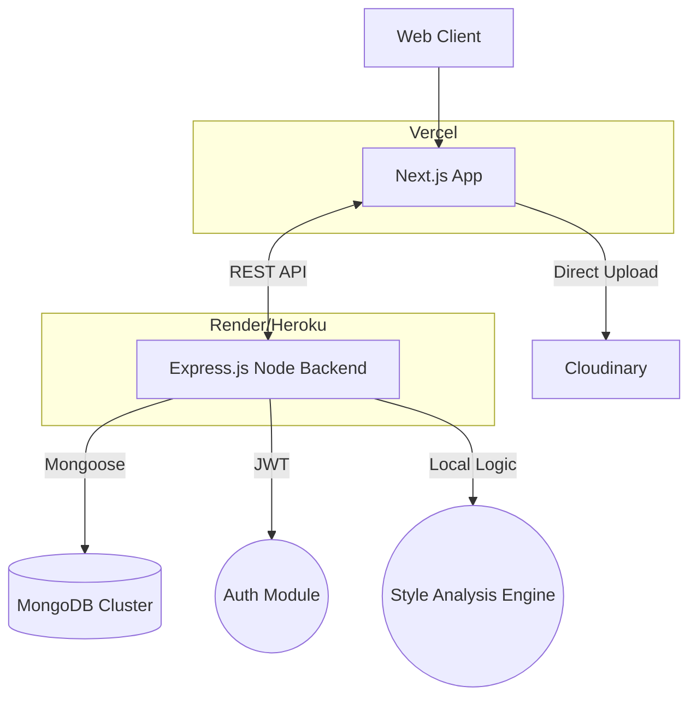
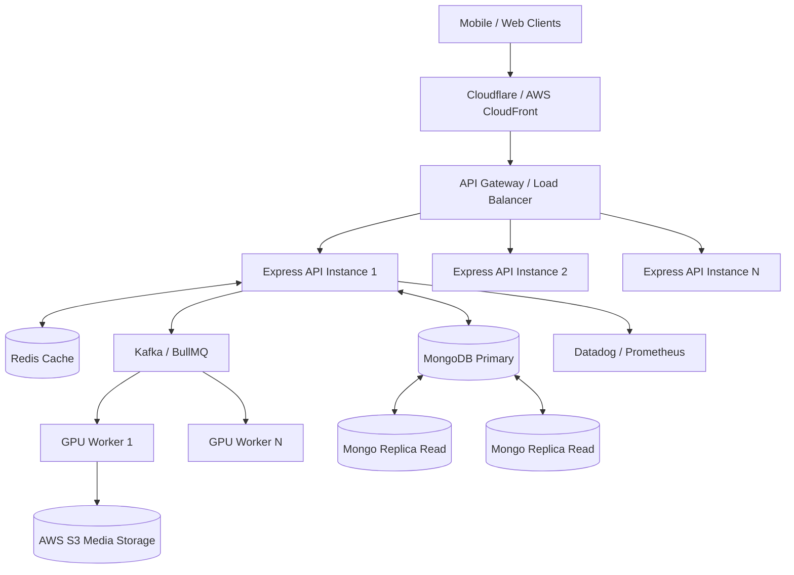
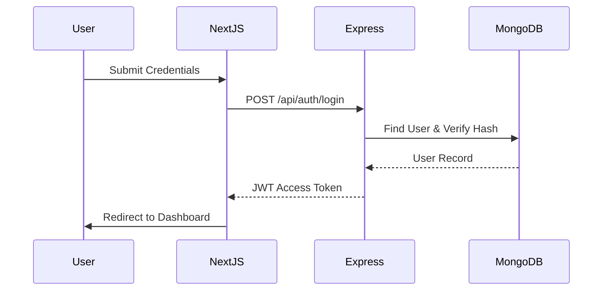
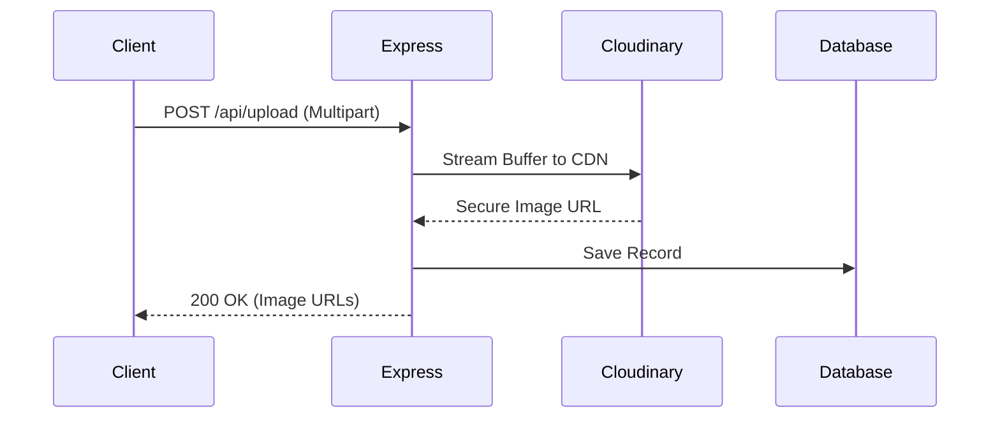
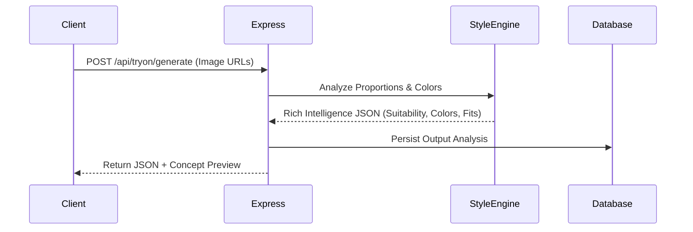

# Scalable Architecture Design

This document outlines the architectural evolution of Fitcheck from its current MVP state to a highly scalable production-grade system capable of handling 1M+ users. 

Fitcheck is an **AI Fashion Compatibility & Style Intelligence Platform** designed to help users visualize their aesthetic through "AI Style Previews" and structured algorithmic fashion intelligence.

---

## 1. Current MVP Architecture

The current architecture is optimized for speed of development, low operating costs, and demonstration of full-stack engineering principles. It relies on a monolithic backend and a serverless frontend, keeping infrastructure complexity low while maintaining a clean separation of concerns.

### MVP Components
*   **Frontend**: Next.js (React) handles UI rendering and client-side routing.
*   **Backend**: Express.js REST API handles business logic and orchestration.
*   **Database**: MongoDB stores User profiles, Generated Images, and Analysis History.
*   **Storage**: Cloudinary acts as a CDN for uploaded images, offloading heavy media storage from the backend.
*   **Auth**: JWT-based stateless authentication.

---

## 2. Future Scalable Production Architecture (1M+ Users)

As the user base scales from 1K to 1M+, the system must evolve to handle increased concurrent traffic, heavy ML inference workloads, and global media delivery. The architecture below outlines the roadmap for high availability and low latency.

### System Design Thinking for Scale

1.  **Load Balancer & API Gateway**: Distributes incoming API requests across horizontally scaled Express.js backend instances.
2.  **CDN (Content Delivery Network)**: Reduces media delivery latency globally by caching CSS, JS, and image assets at edge nodes closer to users.
3.  **Redis Cache**: Stores frequent, non-mutating requests (e.g., fetching a user's recent style analysis) in memory. **Reasoning**: Redis dramatically reduces repeated style-analysis latency and database read-load.
4.  **Message Queue System (Kafka/BullMQ)**: **Reasoning**: A queue system prevents API request blocking during heavy AI generation. When a user requests an analysis, the API acknowledges the request instantly and pushes a job to the queue. The client can poll or use WebSockets for completion.
5.  **Dedicated ML Inference Layer (GPU Workers)**: **Reasoning**: GPU inference workers are separated from the main API servers to isolate heavy compute workloads. This prevents CPU-bound AI tasks from stalling standard REST API operations like login or fetching history.
6.  **Database Replication & Sharding**: MongoDB Primary handles writes, while Replicas handle read-heavy operations. If data grows massively, sharding by `userId` ensures quick historical lookups.
7.  **Rate Limiting & Monitoring**: Prevents abuse and tracks API health, latency, and worker capacity.

---

## 3. Flows

### Authentication Flow
Stateless authentication ensuring secure session management without tying users to a specific API instance.

### Upload & Processing Flow
Optimized media handling where heavy lifting is offloaded to specialized services.

### Recommendation Flow (Style Intelligence)
Deterministic local logic currently, evolving to ML-driven in production.

